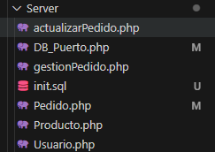
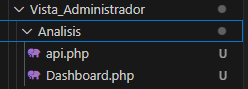

Aqui voy a escribir los cambis que he realizado

1- cree carpeta analisis

2- en la carpeta de Server cree un archivo init.sql(es para que puedan crear mas facil mente la base de datos y las tablas)

3- dentro del archivo init.sql comente el trigger que cree en la base de datos
    este trigger es para que la cantidad de productos en stock vaya disminuyendo ha medida que realizan un pedido
    

    
4- en la carpeta analisis hay dos archivos por ahora el dashboar y el api(este archivo lo voy a cambiar a server cuando funcione, ese archivo es para hacer las consulta )
    

    
5- arregle un bug en la carpeta de vista administrados archivo P_Productos(no se anadia los nuevos productos a la base de datos)
