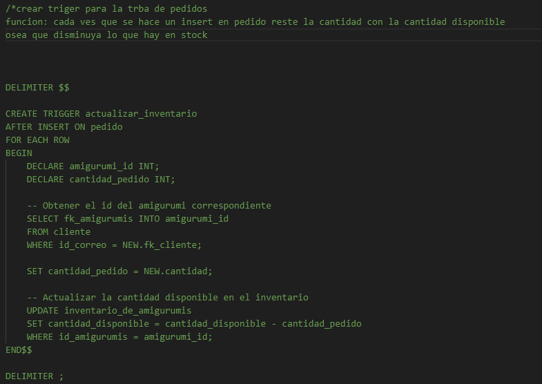

Aqui voy a escribir los cambis que he realizado

1- cree carpeta analisis

2- en la carpeta de Server cree un archivo init.sql(es para que puedan crear mas facil mente la base de datos y las tablas)

3- dentro del archivo init.sql comente el trigger que cree en la base de datos
    este trigger es para que la cantidad de productos en stock vaya disminuyendo ha medida que realizan un pedido
    

    
4- en la carpeta analisis hay dos archivos por ahora el dashboar y el api(este archivo lo voy a cambiar a server cuando funcione, ese archivo es para hacer las consulta )
    

    
5- arregle un bug en la carpeta de vista administrados archivo P_Productos(no se anadia los nuevos productos a la base de datos)
<h1>CASO DE USO Analisis de venta y reportes</h1>

*Actores*
    -Administrador
    -Sistema "Mugumis Store"
    
*Descripción*
El caso de uso describe cómo el administrador de "Mugumis Store" puede utilizar el sistema para analizar las ventas, identificar los productos más y menos vendidos, revisar la cantidad de stock y generar reportes.

*Precondiciones*
    -El administrador debe estar autenticado en el sistema.
    -El sistema debe tener acceso a la base de datos de ventas y productos.
    
*Flujo Principal*
    1-Inicio de sesión:
        -El administrador ingresa sus credenciales y accede al sistema.
    2-Acceso al módulo de análisis de ventas:
        -El administrador selecciona la opción "Análisis de Ventas" en el menú principal.
    3-Visualización de estadísticas:
        -El sistema muestra un dashboard con gráficos y métricas clave, incluyendo:
        -Ventas diarias, semanales, mensuales y anuales.
        -Productos más vendidos.
        -Productos menos vendidos.
        -Cantidad de stock actual por producto.
        
    4-Generación de reportes:
        -El administrador selecciona la opción "Generar Reporte".
        -El sistema presenta opciones para personalizar el reporte (rango de fechas, categorías de productos).
        -El administrador configura las opciones y confirma la generación del reporte.
        -El sistema genera el reporte en el formato seleccionado (PDF, Excel(si toma mucho tiempo lo quito)) y lo muestra para descarga.
        
    5-Exportación de reportes:
        -El administrador descarga el reporte generado y puede revisarlo fuera de la plataforma.

    6-Notificaciones de stock:
            (aqui pensaba solo poner una alerta apenas se habra el dashboar)
        -El sistema envía notificaciones automáticas para productos con baja rotación o stock limitado.

*Flujo Alternativo*
    1-Error en la generación del reporte:
        Si ocurre un error durante la generación del reporte, el sistema muestra un mensaje de error.
        El administrador puede reintentar la generación del reporte o contactar al soporte técnico.

*Postcondiciones*
    -El administrador tiene acceso a un reporte detallado sobre las ventas y el rendimiento de los productos.
    -El sistema actualiza las métricas y gráficos en tiempo real según los datos de ventas más recientes.

*Requisitos del Sistema*

Funcionales:

    -Generar gráficos de ventas por fecha y categoría de producto.
    -Listar los productos más y menos vendidos.
    -Mostrar resúmenes de ventas totales diarias, semanales, mensuales y anuales.
    -Exportar informes en formatos PDF y Excel.
    -Enviar notificaciones automáticas para productos con baja rotación o stock limitado.

    
No Funcionales:
    -El sistema garantiza la seguridad de los datos mediante conexiones cifradas.
    -Los informes se generan rápidamente, incluso con grandes cantidades de datos.
    -La base de datos esta optimizada para manejar el aumento de información y consultas frecuentes.
